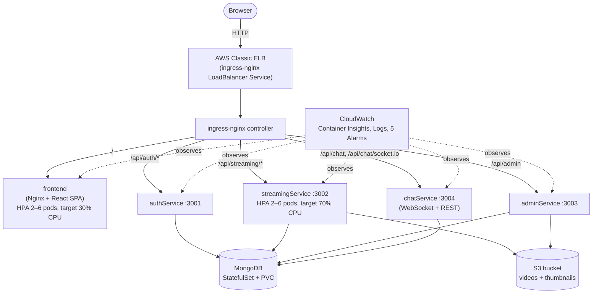

# StreamingApp

Stream premium video content, host live watch parties, and manage your catalogue with a modern microservice architecture. The platform now ships with a production-ready admin portal, real-time chat, S3-backed adaptive streaming, and a redesigned cinematic frontend experience.

## Architecture

| Service | Port | Description |
| --- | --- | --- |
| `authService` | 3001 | User authentication, registration, JWT issuance |
| `streamingService` | 3002 | Video catalogue, S3 playback endpoints, public APIs |
| `adminService` | 3003 | Dedicated admin microservice for asset management and uploads |
| `chatService` | 3004 | Websocket + REST chat for live watch parties |
| `frontend` | 3000 | React SPA with revamped UI and integrated chat |
| `mongo` | 27017 | Shared MongoDB instance |

All backend services share common database models and utilities through `backend/common`.

## Kubernetes Deployment (AWS EKS)

This is how the app actually runs in the graded deployment — a five-service stack behind one ingress, on EKS, shipped via Jenkins CI to ECR and installed with Helm. Local Docker Compose (below) is for development only.



### Pipeline: commit → running pod

1. Push to `main` → Jenkins (webhook-triggered, see `Jenkinsfile`) builds all 5 Docker images and pushes each to its own ECR repo (`streamingapp/<service>:1.0.<build-number>`).
2. `helm upgrade` (see below) rolls the new tag out to EKS with a zero-downtime `RollingUpdate` (`maxUnavailable: 0`, `maxSurge: 1`) on every Deployment.
3. `ingress-nginx` — installed separately by the infra repo, not this chart — routes external traffic in.

### Prerequisites

The AWS side (EKS cluster, ECR repos, S3 bucket, ingress-nginx, IAM, CloudWatch) is provisioned by the companion **[streamingapp-infra](https://github.com/shaikhniraj/streamingapp-infra)** repo via Terraform/Terragrunt — see its README for that setup. Once that's applied, from here you need:

- `kubectl`, pointed at the cluster: `aws eks update-kubeconfig --region us-east-1 --name streamingapp-dev-cluster`
- `helm` 3
- The ingress's public hostname: `cd streamingapp-infra/live/dev/ingress-nginx && terragrunt output load_balancer_hostname`

### Deploying / updating the app

```bash
cd charts/streamingapp

# One-time: copy the template and fill in real secrets (never commit this file)
cp values-secrets.yaml-template values-secrets.yaml

# Set image.tag in values.yaml to the build you want (Jenkins prints the tag it just pushed),
# and clientUrl to the ingress hostname from the prerequisites step above, then:
helm upgrade --install streamingapp . \
  -f values.yaml \
  -f values-secrets.yaml \
  --wait

# Watch the rollout
kubectl rollout status deployment/streamingapp-frontend
kubectl get pods,svc,ingress
```

Open `http://<ingress-hostname>/` in a browser — everything (frontend, register/login, admin upload, playback, chat) is reached through that single host.

### Ingress routing

Two `Ingress` resources split the paths that need a rewrite from the ones that don't (see `charts/streamingapp/templates/ingress.yaml`):

| Path | Backend | Port | Rewrite? |
|---|---|---|---|
| `/api/auth/*` | `auth-svc` | 3001 | Yes — `/api/auth/login` → `/api/login` (authService mounts its routes without the `/auth` segment) |
| `/api/streaming/*` | `streaming-svc` | 3002 | Yes — same idea, but see the note below |
| `/api/admin` | `admin-svc` | 3003 | No |
| `/api/chat` (+ `/api/chat/socket.io` for WebSocket) | `chat-svc` | 3004 | No |
| `/` (catch-all) | `frontend-svc` | 80 | No |

> **Why `/api/streaming/streaming/...`-looking URLs are correct:** the rewrite annotation strips the literal `/api/streaming` prefix and re-adds a bare `/api/`, so a request has to start with `/api/streaming/streaming/...` for the *rewritten* path to land back on `streamingService`'s own `/api/streaming/<route>` Express mount. The frontend's API base URL (`/api/streaming`) plus its own relative calls (`/streaming/videos`, `/streaming/stream/:id`) produce that doubled segment automatically — if you're adding a new streaming endpoint, match that shape rather than the more obvious-looking single-prefix path.

### Scaling

`frontend` and `streaming` each have a `HorizontalPodAutoscaler` (`charts/streamingapp/templates/hpa.yaml`), reading CPU% from the cluster's `metrics-server` add-on (installed by the infra repo — HPA has nothing to read without it):

| Service | Min | Max | Target CPU |
|---|---|---|---|
| `frontend` | 2 | 6 | 30% |
| `streaming` | 2 | 6 | 70% |

Verified live: both scale up under a synthetic load test and back down to 2 replicas once load clears. A service opts in by adding an `hpa:` block to its `values.yaml` entry — `deployment.yaml`'s template omits the static `replicas:` field whenever `hpa.enabled` is set, so Helm stops fighting the HPA controller over desired replica count on every upgrade.

### Monitoring & Logging

The infra repo's `monitoring` component installs the `amazon-cloudwatch-observability` EKS add-on — Container Insights metrics (CPU/memory/restarts per pod and node) and centralized logs (`/aws/containerinsights/streamingapp-dev-cluster/*`) with no changes needed here, plus 5 CloudWatch alarms (node CPU/memory, pod restarts, ingress ELB unhealthy hosts, ingress ELB 5xx rate) publishing to one SNS topic. See that repo's README for the full alarm table and how to subscribe to it.

### Verification checklist (all confirmed working)

- [x] `kubectl get pods` shows every Deployment at its desired replica count, all `Running`/`Ready`
- [x] Register and log in through the ingress hostname, receive a valid JWT
- [x] Upload a video + thumbnail through the admin dashboard
- [x] Playback streams correctly from the browse page
- [x] Chat messages broadcast live between two browser tabs
- [x] Deleting a pod: the Deployment recreates it automatically with **zero dropped requests** to the app during the replacement (verified with continuous traffic against the ingress hostname across the delete-and-recreate cycle)
- [x] HPA scales `frontend`/`streaming` out under load and back in at rest

### What we'd change for a real production cluster

Namespace-per-environment instead of everything in `default` (so `dev`/`staging`/`prod` don't share RBAC or resource quotas); TLS via `cert-manager` + a real DNS name in front of the ELB instead of plain HTTP on an AWS-generated hostname; secrets pulled from AWS Secrets Manager / External Secrets Operator instead of a manually-populated `values-secrets.yaml`; a managed MongoDB (Atlas or DocumentDB) with automated backups instead of a single-replica StatefulSet with no failover; HPA already covers CPU-based scaling for the two hottest services, but it's worth extending to `auth`/`admin`/`chat` too and adding memory-based or custom-metric targets; and network policies to restrict which pods can talk to which (right now every pod can reach every other pod on any port, which is broader than any service actually needs).

## Environment Configuration

Create an `.env` for each service (or export variables before running). All services accept the standard AWS credentials for S3 access.

### Auth Service (`backend/authService/.env`)
```ini
PORT=3001
MONGO_URI=mongodb://localhost:27017/streamingapp
JWT_SECRET=changeme
CLIENT_URLS=http://localhost:3000
AWS_ACCESS_KEY_ID=
AWS_SECRET_ACCESS_KEY=
AWS_REGION=ap-south-1
AWS_S3_BUCKET=
```

### Streaming Service (`backend/streamingService/.env`)
```ini
PORT=3002
MONGO_URI=mongodb://localhost:27017/streamingapp
JWT_SECRET=changeme
CLIENT_URLS=http://localhost:3000
AWS_ACCESS_KEY_ID=
AWS_SECRET_ACCESS_KEY=
AWS_REGION=ap-south-1
AWS_S3_BUCKET=
AWS_CDN_URL=
STREAMING_PUBLIC_URL=http://localhost:3002
```

### Admin Service (`backend/adminService/.env`)
```ini
PORT=3003
MONGO_URI=mongodb://localhost:27017/streamingapp
JWT_SECRET=changeme
CLIENT_URLS=http://localhost:3000
AWS_ACCESS_KEY_ID=
AWS_SECRET_ACCESS_KEY=
AWS_REGION=ap-south-1
AWS_S3_BUCKET=
```

### Chat Service (`backend/chatService/.env`)
```ini
PORT=3004
MONGO_URI=mongodb://localhost:27017/streamingapp
JWT_SECRET=changeme
CLIENT_URLS=http://localhost:3000
```

### Frontend build variables (`frontend/.env` or Docker build args)
```ini
REACT_APP_AUTH_API_URL=http://localhost:3001/api
REACT_APP_STREAMING_API_URL=http://localhost:3002/api
REACT_APP_STREAMING_PUBLIC_URL=http://localhost:3002
REACT_APP_ADMIN_API_URL=http://localhost:3003/api/admin
REACT_APP_CHAT_API_URL=http://localhost:3004/api/chat
REACT_APP_CHAT_SOCKET_URL=http://localhost:3004
```

## Running with Docker Compose

1. Populate the environment variables above (or rely on the defaults baked into `docker-compose.yml`).
2. Build and start the stack:
   ```bash
   docker-compose up --build
   ```
3. Navigate to `http://localhost:3000` for the web app.

The compose file provisions MongoDB plus all four Node.js microservices. S3 credentials are optional for local testing—you can still browse seeded metadata, but streaming requires valid S3 objects.

## Local Development

Install dependencies for each service:

```bash
# auth service
cd backend/authService && npm install

# streaming service
cd ../streamingService && npm install

# admin service
cd ../adminService && npm install

# chat service
cd ../chatService && npm install

# frontend
cd ../../frontend && npm install
```

Run the services (in separate terminals) after starting MongoDB:

```bash
cd backend/authService && npm run dev
cd backend/streamingService && npm run dev
cd backend/adminService && npm run dev
cd backend/chatService && npm run dev
cd frontend && npm start
```

## Feature Highlights

- **S3-backed adaptive streaming** with secure signed uploads for admins.
- **Dedicated admin microservice** for video ingestion, metadata management, and featured curation.
- **Real-time chat** overlay in the player (Socket.IO + persistent message history).
- **Modern React experience** featuring cinematic hero sections, dynamic carousels, and responsive design.
- **Role-aware access control** across frontend routes and backend microservices.

## Testing

Automated tests are not yet included. For local dev, the same checks as the [Kubernetes verification checklist](#verification-checklist-all-confirmed-working) above apply:

1. Register and log in through the web UI.
2. Upload a small video + thumbnail via the admin dashboard (requires valid S3 credentials).
3. Confirm playback from the browse page and verify that chat messages broadcast between multiple browser tabs.

## License

MIT © StreamFlix Team
